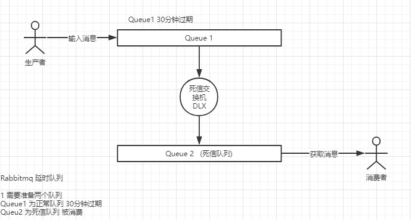

延迟队列在rabbitmq的实现方式有两种：

1 .延迟队列在RabbitMQ 3.6.x 之前我们一般采用死信队列+死信交换机DLX+TTL过期时间来实现延迟队列（本篇文章讲该种方式）

2 .在 RabbitMQ 3.6.x 开始，RabbitMQ 官方提供了延迟队列的插件，可以下载放置到 RabbitMQ 根目录下的 plugins 下。

本篇文章主要讲解第一种：死信队列+TTL过期时间来实现延迟队列的方式

先介绍几个概念

死信队列：没有被及时消费的消息存放的队列，没有被及时消费的原因大致有三个：

- 消息被拒绝（basic.reject/ basic.nack）并且不再重新投递 requeue=false

- TTL(time-to-live) 消息超时未消费

  TTL表明了一条消息可在队列中存活的最大时间。当某条消息被设置了TTL或者当某条消息进入了设置了TTL的队列时，这条消息会在TTL时间后**死亡成为Dead Letter**。如果既配置了消息的TTL，又配置了队列的TTL，那么较小的那个值会被取用。

  设置消息的过期时间用  x-message-ttl 参数实现，单位毫秒。

  设置队列的过期时间用 x-expires 参数，单位毫秒，注意，不能设置为0。

- 达到最大队列长度

  队列长度的限制方式有：

  - 对队列中消息的条数进行限制  x-max-length

  - 对队列中消息的总量进行限制  x-max-length-bytes

    

    **注意，队列的有效期并不会导致其中的消息过期 ** 

死信交换机：当队列中的消息变成死信后，消息将会被重新发送到一个交换机。该交换机是死信交换机。

DLX和一般的交换器没有区别，可以声明在任何的队列上，理解为队列的一个属性吧。当这个队列有死信时会根据设置自动的将死信重新发布到设置的DLX上进行消费。**这个消费了死信的队列称之为死信队列，并不是绑定了DLX的队列是死信队列，大家要一定区分清楚。**




代码形式：

```java
//死信队列   
private static final String DELAY_RESUME_QUEUE = "delay_Resume_queue";  
//正常队列    
private static final String NORMAL_QUEUE = "normal_queue";   
//死信交换器   
private static final String DELAY_RESUME_EXCHANGE = "delay_resume_exchange";    
//死信路由键   
private static final String DELAY_RESUME_KEY = "delay_resume_key";
```

生产者：

```java
 amqpTemplate.convertAndSend("normal_exchange", "normal_key", order);       
```

正常队列 交换机 及路由键绑定

```java
 /**正常队列 */     
@Bean   
public Queue normalQueue() {       
    Map<String, Object> map = new HashMap<>();       
    map.put("x-message-ttl", 10000);//设置10s过期时间        
    //x-dead-letter-exchange参数是设置该队列的死信交换器（DLX）      
    map.put("x-dead-letter-exchange", DELAY_RESUME_EXCHANGE);      
    //x-dead-letter-routing-key参数是给这个DLX指定路由键    
    map.put("x-dead-letter-routing-key", DELAY_RESUME_KEY);     
    return new Queue(NORMAL_QUEUE, true, false, false, map);    
}
    /**正常交换器 */   
@Bean    
public DirectExchange normalExchange() {       
    return new DirectExchange("normal_exchange", true, false);    
}
    /**正常队列绑定     */  
@Bean    
public Binding normalBinding(Queue normalQueue, DirectExchange normalExchange)
{      
    return BindingBuilder.bind(normalQueue).to(normalExchange).with("normal_key");   
 }

```

死信队列 交换机 及路由键绑定

```java
/* 死信队列 */
@Bean
public Queue delayResumeQueue() {
    return new Queue(DELAY_RESUME_QUEUE);
}

/* 死信交换机 */
@Bean    
public DirectExchange delayResumeExchange() {        
    return new DirectExchange(DELAY_RESUME_EXCHANGE, true, false);    
}

/* 死信队列 及交换机 绑定*/
@Bean
 Binding delayResumeBinding(Queue delayResumeQueue, DirectExchange delayResumeExchange) {
     return BindingBuilder.bind(delayResumeQueue).to(delayResumeExchange).with(DELAY_RESUME_KEY);
 }


```


消费者：

```java
@RabbitListener(queues = "delay_Resume_queue")    
@RabbitHandler   
public void delay(Order order) {       
    // 业务处理 
}
```


https://mp.weixin.qq.com/s/FPvIWGCAaJnxwHkqLeNMYQ

<https://www.cnblogs.com/haixiang/p/10905189.html>